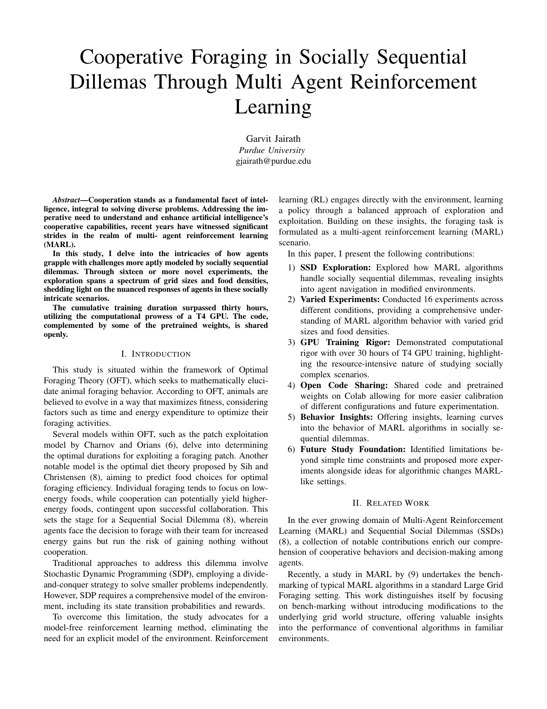

# cooperative_foraging

A project I whipped up at some point in my adult life to see how agents grapple with challenges more aptly modeled by socially sequential dilemmas.

The only social dillemas I've struggled with were with multiple-women who are currently in the scorned status.

[Projecto](rl_foraging_coop.pdf)

